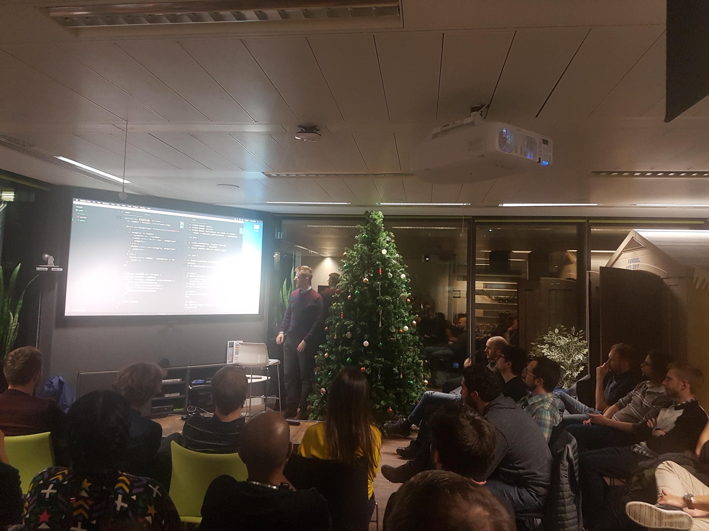

## Reyakt

This application was written as part of my second talk at [React Edinburgh Meetup in December 2018](https://twitter.com/ReactEdinburgh/status/937703615979978752).

My talk was titled 'React in Vanilla JavaScript: Removing the Layer of Abstraction'

I challenged myself to recreate React's JSX methodology in as short a time as possible.

The excercise was about learning how the tools we use on a daily basis work when you remove the layer of abstraction that they give you.

Each branch adds progressively more functionality until the application finally starts to resemble an extremely basic version of React (but obviously nowhere near as good as the real thing!)

